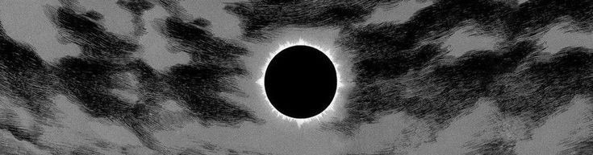

<div align="center">
  
  
  
</div>

```bash
$ status --user "rinnegannn"
> ROLE:    Software Engineering @ McMaster (Co-op)
> FOCUS:   Cybersecurity | Machine Learning | Cloud Architecture
> MISSION: Building scalable, reliable systems.
```

<p align="center">
  <a href="https://rinnegannn.github.io/aryan-portfolio/"><b>Portfolio</b></a> • 
  <a href="https://linkedin.com/in/aryanverma1"><b>LinkedIn</b></a> • 
  <a href="mailto:aryanv1945@gmail.com"><b>Contact</b></a>
</p>

---

### ✦ About Me
Software Engineering student at **McMaster University** focused on **AI**, **Cybersecurity**, and **Cloud Architecture**. Experience spans **low-level C networking**, **React/PostgreSQL** platforms, and **LLM automation**. Currently exploring **Operating Systems** and **Distributed Databases**.

- **Accolades:** Provost's Honour Roll · Dean's Honour List
- **Interests:** Anime · Competitive Gaming · LeetCode (yes i'm not lying) · Chess · Golf

---

### ✦ Top Projects

#### 1. [WireFish](https://github.com/rinnegannn/wirefish)
*A high-performance, minimalist network diagnostics engine engineered in C.*
- **Core Engineering:** Implemented low-level socket programming for TCP port scanning, ICMP traceroute, and real-time interface monitoring.
- **Key Insight:** Designed to learn networking fundamentals and the complexities of systems-level resource management.
- **Tools:** C, POSIX Threads, Raw Sockets, Linux.

#### 2. [ReliefLocator](https://github.com/rinnegannn/relieflocator)
*Full-stack humanitarian platform designed for real-time crisis response.*
- **Core Engineering:** Developed a responsive mapping system using React and Leaflet, backed by a PostgreSQL database for emergency resource management.
- **Key Insight:** Combines geospatial data with intuitive UI/UX to solve real-world logistical challenges in emergency aid.
- **Tools:** React, Leaflet.js, PostgreSQL, Node.js.

#### 3. [ObjectDetector](https://github.com/rinnegannn/objectdetector)
*Assistive-technology vision system optimized for low-latency visual recognition.*
- **Core Engineering:** Architected a real-time detection pipeline using YOLOv8 and Flask, specifically designed for users with Usher Syndrome.
- **Key Insight:** Prioritizes accessibility and feedback, demonstrating the intersection of applied computer vision and inclusive design.
- **Tools:** Python, YOLOv8, Flask, Computer Vision.

---

### ✦ Technical Stack
| Category | Tools |
| :--- | :--- |
| **Languages** | `Python` `Java` `C` `C++` `JavaScript` `Swift` `SQL` |
| **Frameworks** | `React` `Node.js` `Express` `Flask` `SwiftUI` `Framer Motion` |
| **DevOps** | `AWS` `Docker` `CI/CD` `Linux` `Bash` `Git` |

---

### ✦ Activity
<div align="center">
  <picture>
    <source media="(prefers-color-scheme: dark)" srcset="https://raw.githubusercontent.com/rinnegannn/rinnegannn/output/github-contribution-grid-snake-dark.svg">
    <source media="(prefers-color-scheme: light)" srcset="https://raw.githubusercontent.com/rinnegannn/rinnegannn/output/github-contribution-grid-snake.svg">
    
  </picture>
</div>

---

<div align="center">
  
  <br /><br />
  <b>// chat, is this aura farming?</b>
</div>
