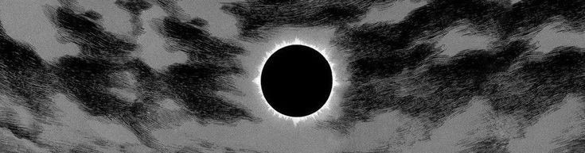

<div align="center">
  
  
  
</div>

```bash
$ status --user "rinnegannn"
> ROLE:    Software Engineering @ McMaster (Co-op)
> FOCUS:   Cybersecurity | Machine Learning | Cloud Architecture
> MISSION: Building scalable, reliable systems.
```

<p align="center">
  <a href="https://rinnegannn.github.io/aryan-portfolio/"><b>Portfolio</b></a> • 
  <a href="https://linkedin.com/in/aryanverma1"><b>LinkedIn</b></a> • 
  <a href="mailto:aryanv1945@gmail.com"><b>Contact</b></a>
</p>

---

### ✦ About Me
Software Engineering student at **McMaster University** focused on **AI**, **Cybersecurity**, and **Distributed Systems**. Experience spans **low-level C networking**, **Next.js & Web3** architectures, and **LLM automation**. Currently exploring **Operating Systems** and **AI-driven security**.

- **Accolades:** Hackathon Winner (CxC 2026) · Provost's Honour Roll · Dean's Honour List
- **Interests:** Anime · Competitive Gaming · LeetCode (yes i'm not lying) · Chess · Golf

---

### ✦ Top Projects

#### 1. [TruthTone++](https://github.com/rinnegannn/truthtone)
*AI Audio Deepfake Detector · Winner at CxC University of Waterloo (Largest Datathon).*
- **Core Engineering:** Won 1st place among 350+ teams by architecting a deepfake detection system (85-92% accuracy) using custom ML classifiers, Gemini API, and librosa.
- **Key Insight:** Pioneered 3D audio mapping to Three.js meshes and integrated Solana/Metaplex for immutable NFT audio verification.
- **Tools:** Python, TypeScript, Next.js, Three.js, Solana, Gemini AI.

#### 2. [Portfolio Metrics Extractor](https://github.com/rinnegannn/portfolio-metrics-extractor)
*LLM-powered automation pipeline for high-accuracy financial data extraction.*
- **Core Engineering:** Built an automated ETL pipeline achieving 100% accuracy across key metrics by implementing LLM-powered semantic parsing of unstructured quarterly reports.
- **Key Insight:** Handles 10+ inconsistent PDF formats with schema validation and JSON transformation for immediate BI tool integration.
- **Tools:** Python, Gemini AI, pdfplumber, pandas.

#### 3. [WireFish](https://github.com/rinnegannn/wirefish)
*A high-performance, minimalist network diagnostics engine engineered in C.*
- **Core Engineering:** Built POSIX networking utilities implementing raw ICMP packets and non-blocking TCP sockets, reducing network test failures by 60%.
- **Key Insight:** Configured automated GitHub Actions CI/CD pipelines with multi-platform builds to ensure extreme system-level stability.
- **Tools:** C, POSIX, ICMP, TCP/IP, GitHub Actions.

#### 4. [ObjectDetector](https://github.com/rinnegannn/objectdetector)
*Assistive-technology vision system optimized for low-latency visual recognition.*
- **Core Engineering:** Led development of a real-time detection pipeline using YOLOv8, trained on 2,000+ images to detect 50+ items with 90%+ accuracy.
- **Key Insight:** Integrated text-to-speech with OpenCV video processing to enable independent grocery shopping for visually impaired users.
- **Tools:** Python, YOLOv8, OpenCV, TTS.

---

### ✦ Technical Stack
| Category | Tools |
| :--- | :--- |
| **Languages** | `Python` `Java` `C` `C++` `TypeScript` `JavaScript` `SQL` |
| **Frameworks** | `React` `Next.js` `Node.js` `Express` `Flask` `Three.js` `SwiftUI` |
| **AI & Data** | `Gemini AI` `YOLOv8` `OpenCV` `pandas` `PyTorch` `Librosa` |
| **DevOps & Web3** | `AWS` `Docker` `CI/CD` `Solana` `Linux` `Bash` `Git` |

---

### ✦ Activity
<div align="center">
  <picture>
    <source media="(prefers-color-scheme: dark)" srcset="https://raw.githubusercontent.com/rinnegannn/rinnegannn/output/github-contribution-grid-snake-dark.svg">
    <source media="(prefers-color-scheme: light)" srcset="https://raw.githubusercontent.com/rinnegannn/rinnegannn/output/github-contribution-grid-snake.svg">
    
  </picture>
</div>

---

<div align="center">
  
  <br /><br />
  <b>// chat, is this aura farming?</b>
</div>
